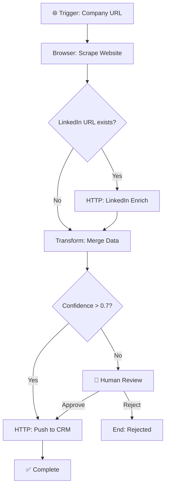

# LEAN CONTEXT PROTOCOL (LCP)
## Specification v0.1.0 — Draft Standard

**Status:** Draft for Review  
**Version:** 0.1.0  
**Date:** 2026-01-24  
**Authors:** ULTRAMIND Collective  
**License:** MIT (proposed open-source)

---

## ABSTRACT

The Lean Context Protocol (LCP) is a specification for defining, loading, and executing tool capabilities in Large Language Model (LLM) agentic systems with minimal context consumption.

LCP replaces always-loaded tool schemas (MCPs) with on-demand skill activation, reducing baseline context from thousands of tokens to ~500 tokens while maintaining full capability access.

**Core Principle:** `Skills + Scripts > MCPs`

---

## 1. INTRODUCTION

### 1.1 Problem Statement

Current agentic tool-calling approaches suffer from **context bloat**:

| Approach | Baseline Context Cost | Issues |
|----------|----------------------|--------|
| MCP (full schemas) | 2,000-10,000+ tokens | Always loaded, competes with reasoning |
| n8n/Make visual | N/A (external) | Brittle, no version control, visual spaghetti |
| Raw function calling | 500-2,000 tokens | Per-tool schemas add up quickly |

As agents gain access to more tools, context windows fill with schema definitions, leaving less room for actual reasoning and task execution.

### 1.2 Solution Overview

LCP introduces a **tiered loading architecture**:

```
┌─────────────────────────────────────────────────────────────────────────────┐
│                         LCP LOADING TIERS                                   │
├─────────────────────────────────────────────────────────────────────────────┤
│                                                                             │
│  TIER 0: ZERO-POINT (~500 tokens, always loaded)                           │
│  └── Skills manifest (names + one-line descriptions)                       │
│  └── SSOT headers (state pointers)                                         │
│  └── Routing rules (which skill for which task type)                       │
│                                                                             │
│  TIER 1: SKILL DESCRIPTOR (~200-500 tokens, loaded on selection)           │
│  └── Full capability declaration                                           │
│  └── Input/output schemas                                                  │
│  └── Error map                                                             │
│                                                                             │
│  TIER 2: EXECUTION CONTEXT (~500-2000 tokens, loaded during execution)     │
│  └── Script code or reference                                              │
│  └── Configuration and credentials (pointers)                              │
│  └── Detailed documentation                                                │
│                                                                             │
│  TIER 3: RESULTS (~variable, compressed after execution)                   │
│  └── Execution output                                                      │
│  └── SSOT updates                                                          │
│  └── Compressed summary for context                                        │
│                                                                             │
└─────────────────────────────────────────────────────────────────────────────┘
```

### 1.3 Design Goals

1. **Minimal Baseline** — ~500 tokens at Zero-Point state
2. **On-Demand Loading** — Full schemas only when needed
3. **Graceful Unloading** — Compress results, release context
4. **Code-First** — Scripts as source of truth, not visual nodes
5. **Version Controlled** — Git-friendly, diffable, testable
6. **Interoperable** — Works with any LLM, any runtime

---

## 2. TERMINOLOGY

| Term | Definition |
|------|------------|
| **Zero-Point** | Default context state with minimal footprint (~500 tokens) |
| **Skill** | A capability unit with metadata + script(s) + error handling |
| **Script** | Deterministic code (Python/Node) that executes a single operation |
| **Flowgram** | Visual workflow expressed as skill chains with XML + diagram |
| **SSOT** | Single Source of Truth — canonical state objects |
| **Manifest** | Index of available skills at Zero-Point |
| **Descriptor** | Full skill specification (Tier 1) |
| **Activation** | Loading a skill from manifest into working context |
| **Deactivation** | Compressing results to SSOT and unloading skill |

---

## 3. PROTOCOL LAYERS

### 3.1 Layer Architecture

```
┌─────────────────────────────────────────────────────────────────────────────┐
│                           LCP LAYER STACK                                   │
├─────────────────────────────────────────────────────────────────────────────┤
│                                                                             │
│  L4: FLOWGRAM LAYER (Visual Composition)                                   │
│  └── Workflow definitions                                                  │
│  └── Skill chains and routing                                              │
│  └── Human-readable diagrams                                               │
│                                                                             │
│  L3: SKILL LAYER (Capability Abstraction)                                  │
│  └── Skill descriptors                                                     │
│  └── Input/output contracts                                                │
│  └── Error maps and fallbacks                                              │
│                                                                             │
│  L2: SCRIPT LAYER (Execution Logic)                                        │
│  └── Python/Node functions                                                 │
│  └── API integrations                                                      │
│  └── Data transformations                                                  │
│                                                                             │
│  L1: PACKAGE LAYER (Dependencies)                                          │
│  └── NPM/PIP packages                                                      │
│  └── CLI tools                                                             │
│  └── External services                                                     │
│                                                                             │
└─────────────────────────────────────────────────────────────────────────────┘
```

### 3.2 Layer Responsibilities

**L1: Package Layer**
- Wraps external dependencies (requests, playwright, stripe-sdk, etc.)
- Provides consistent interface regardless of underlying package
- Handles version management and compatibility

**L2: Script Layer**
- Implements single-purpose functions
- Enforces idempotency where possible
- Provides structured error handling
- Includes logging and observability hooks

**L3: Skill Layer**
- Exposes capabilities to agents
- Defines input/output contracts
- Maps errors to recovery actions
- Manages activation/deactivation lifecycle

**L4: Flowgram Layer**
- Composes skills into workflows
- Defines control flow (sequence, parallel, conditional)
- Provides visual representation
- Supports human-in-the-loop checkpoints

---

## 4. SCHEMA DEFINITIONS

### 4.1 Skills Manifest (Zero-Point)

The manifest is always loaded. Target: <500 tokens total.

```yaml
# LCP Skills Manifest Schema
manifest:
  version: "0.1.0"
  last_updated: "2026-01-24T12:00:00Z"
  
  skills:
    - id: "http_client"
      name: "HTTP Client"
      brief: "Make HTTP requests (GET, POST, PUT, DELETE)"
      tags: ["api", "network", "integration"]
      
    - id: "browser_automation"
      name: "Browser Automation"
      brief: "Control headless browser for scraping and interaction"
      tags: ["browser", "scraping", "automation"]
      
    - id: "data_transform"
      name: "Data Transformer"
      brief: "Transform, filter, and reshape data structures"
      tags: ["data", "transform", "etl"]
      
    # ... more skills (one-liner each)
    
  routing_hints:
    api_calls: ["http_client"]
    web_scraping: ["browser_automation", "http_client"]
    data_processing: ["data_transform"]
```

**Token Budget:** ~50-100 tokens per 10 skills

### 4.2 Skill Descriptor (Tier 1)

Loaded when skill is selected. Target: 200-500 tokens.

```yaml
# LCP Skill Descriptor Schema
skill:
  id: "http_client"
  version: "1.0.0"
  tier: "execution"
  
  # Brief (from manifest)
  brief: "Make HTTP requests (GET, POST, PUT, DELETE)"
  
  # Full description (Tier 1)
  description: |
    Performs HTTP requests with automatic retry, rate limiting,
    and structured error handling. Supports JSON, form data,
    and binary responses.
    
  capabilities:
    - "http_get"
    - "http_post"
    - "http_put"
    - "http_delete"
    - "http_download"
    
  inputs:
    url:
      type: "string"
      required: true
      description: "Target URL"
    method:
      type: "enum"
      values: ["GET", "POST", "PUT", "DELETE"]
      default: "GET"
    headers:
      type: "object"
      required: false
    body:
      type: "any"
      required: false
    timeout:
      type: "integer"
      default: 30
      
  outputs:
    status_code:
      type: "integer"
    headers:
      type: "object"
    body:
      type: "any"
    elapsed_ms:
      type: "integer"
      
  error_map:
    timeout: "Retry with exponential backoff, max 3 attempts"
    rate_limited: "Wait for Retry-After header, then retry"
    auth_failed: "Check credentials, do not retry"
    server_error: "Retry once, then escalate"
    
  dependencies:
    packages: ["httpx>=0.24.0"]
    credentials: ["api_keys (optional)"]
    
  example_call:
    input:
      url: "https://api.example.com/users"
      method: "GET"
      headers:
        Authorization: "Bearer ${API_KEY}"
    output:
      status_code: 200
      body: [{"id": 1, "name": "Alice"}]
```

### 4.3 Script Definition (Tier 2)

Loaded during execution. Variable size.

```python
# LCP Script Template
"""
Script: http_client.py
Skill: http_client
Version: 1.0.0
"""

import httpx
from typing import Any, Dict, Optional
from pydantic import BaseModel
import logging

logger = logging.getLogger(__name__)

# --- Input/Output Models (from Skill Descriptor) ---

class HTTPRequest(BaseModel):
    url: str
    method: str = "GET"
    headers: Optional[Dict[str, str]] = None
    body: Optional[Any] = None
    timeout: int = 30

class HTTPResponse(BaseModel):
    status_code: int
    headers: Dict[str, str]
    body: Any
    elapsed_ms: int

# --- Main Function ---

async def execute(request: HTTPRequest) -> HTTPResponse:
    """
    Execute HTTP request with retry logic.
    
    Idempotent: Yes (for GET/DELETE), No (for POST/PUT)
    Side Effects: Network call to external URL
    """
    async with httpx.AsyncClient(timeout=request.timeout) as client:
        try:
            response = await client.request(
                method=request.method,
                url=request.url,
                headers=request.headers,
                json=request.body if request.method in ["POST", "PUT"] else None
            )
            
            return HTTPResponse(
                status_code=response.status_code,
                headers=dict(response.headers),
                body=response.json() if "application/json" in response.headers.get("content-type", "") else response.text,
                elapsed_ms=int(response.elapsed.total_seconds() * 1000)
            )
            
        except httpx.TimeoutException as e:
            logger.error(f"Timeout: {request.url}")
            raise HTTPTimeoutError(url=request.url, timeout=request.timeout)
            
        except httpx.HTTPStatusError as e:
            logger.error(f"HTTP Error: {e.response.status_code}")
            raise HTTPStatusError(status_code=e.response.status_code, detail=str(e))

# --- Error Classes ---

class HTTPTimeoutError(Exception):
    def __init__(self, url: str, timeout: int):
        self.url = url
        self.timeout = timeout
        self.recovery_action = "retry_with_backoff"
        
class HTTPStatusError(Exception):
    def __init__(self, status_code: int, detail: str):
        self.status_code = status_code
        self.detail = detail
        self.recovery_action = "check_auth" if status_code == 401 else "retry_once"
```

### 4.4 Flowgram Definition (Tier 4)

```xml
<?xml version="1.0" encoding="UTF-8"?>
<!-- LCP Flowgram Schema -->
<Flowgram
  id="lead_enrichment_flow"
  version="1.0.0"
  name="Lead Enrichment Pipeline"
>
  <Meta>
    <Description>Scrape lead info, enrich with LinkedIn, output to CRM</Description>
    <Author>ULTRAMIND</Author>
    <Created>2026-01-24</Created>
    <Tags>lead-gen, enrichment, crm</Tags>
  </Meta>
  
  <!-- Skill Dependencies -->
  <Skills>
    <Skill ref="browser_automation" />
    <Skill ref="http_client" />
    <Skill ref="data_transform" />
  </Skills>
  
  <!-- Workflow Steps -->
  <Flow>
    <!-- Step 1: Scrape Company Website -->
    <Step id="scrape_website" skill="browser_automation">
      <Input>
        <Param name="url" source="trigger.company_url" />
        <Param name="selectors">
          <Selector name="email" css=".contact-email" />
          <Selector name="phone" css=".contact-phone" />
        </Param>
      </Input>
      <Output ref="company_data" />
    </Step>
    
    <!-- Step 2: Enrich with LinkedIn (Conditional) -->
    <Step id="linkedin_enrich" skill="http_client" condition="company_data.linkedin_url != null">
      <Input>
        <Param name="url" value="https://api.enrichment.io/linkedin" />
        <Param name="method" value="POST" />
        <Param name="body">
          <Field name="linkedin_url" source="company_data.linkedin_url" />
        </Param>
      </Input>
      <Output ref="linkedin_data" />
    </Step>
    
    <!-- Step 3: Transform and Merge -->
    <Step id="merge_data" skill="data_transform">
      <Input>
        <Param name="sources">
          <Source ref="company_data" />
          <Source ref="linkedin_data" optional="true" />
        </Param>
        <Param name="transform" value="merge_lead_record" />
      </Input>
      <Output ref="enriched_lead" />
    </Step>
    
    <!-- Step 4: Push to CRM -->
    <Step id="crm_push" skill="http_client">
      <Input>
        <Param name="url" value="${CRM_API_URL}/leads" />
        <Param name="method" value="POST" />
        <Param name="headers">
          <Header name="Authorization" value="Bearer ${CRM_API_KEY}" />
        </Param>
        <Param name="body" source="enriched_lead" />
      </Input>
      <Output ref="crm_response" />
    </Step>
  </Flow>
  
  <!-- Error Handling -->
  <ErrorHandling>
    <On error="timeout" step="*" action="retry" max="3" backoff="exponential" />
    <On error="rate_limited" step="linkedin_enrich" action="wait" />
    <On error="auth_failed" step="crm_push" action="escalate" />
  </ErrorHandling>
  
  <!-- Human Checkpoints (optional) -->
  <Checkpoints>
    <Checkpoint after="merge_data" condition="enriched_lead.confidence < 0.7">
      <Prompt>Review enriched lead before CRM push?</Prompt>
      <Actions>
        <Action id="approve" continues="true" />
        <Action id="reject" continues="false" />
        <Action id="edit" opens="lead_editor" />
      </Actions>
    </Checkpoint>
  </Checkpoints>
  
</Flowgram>
```

### 4.5 Visual Representation (Mermaid)

Flowgrams auto-generate visual diagrams:



---

## 5. LIFECYCLE OPERATIONS

### 5.1 Skill Activation

```
ACTIVATION SEQUENCE:
═════════════════════

1. AGENT: Identifies task requires skill (from manifest routing hints)
2. AGENT: Requests skill activation
3. ORCHESTRATOR: Loads Skill Descriptor (Tier 1) into context
4. AGENT: Reviews capabilities, confirms fit
5. ORCHESTRATOR: Loads Script (Tier 2) if needed for execution
6. AGENT: Executes skill with inputs
7. SCRIPT: Returns structured output
8. ORCHESTRATOR: Compresses output to SSOT
9. ORCHESTRATOR: Unloads Tier 2, optionally Tier 1
10. RETURN: To Zero-Point with SSOT updated
```

### 5.2 Context Management

```python
# LCP Context Manager (Pseudocode)

class LCPContextManager:
    def __init__(self, max_tokens: int = 8000):
        self.max_tokens = max_tokens
        self.zero_point_budget = 500
        self.active_skills = []
        
    def estimate_tokens(self, content: str) -> int:
        # Rough estimate: 4 chars = 1 token
        return len(content) // 4
        
    def available_tokens(self) -> int:
        used = self.zero_point_budget
        used += sum(s.token_cost for s in self.active_skills)
        return self.max_tokens - used
        
    def can_activate(self, skill: Skill) -> bool:
        return self.available_tokens() >= skill.tier1_cost + skill.tier2_cost
        
    def activate(self, skill_id: str) -> Skill:
        skill = self.load_descriptor(skill_id)  # Tier 1
        if not self.can_activate(skill):
            self.deactivate_oldest()  # Make room
        self.active_skills.append(skill)
        return skill
        
    def deactivate(self, skill_id: str) -> dict:
        skill = self.find_active(skill_id)
        result = skill.compress_state()  # Tier 3
        self.active_skills.remove(skill)
        return result
        
    def deactivate_oldest(self):
        if self.active_skills:
            oldest = min(self.active_skills, key=lambda s: s.last_used)
            self.deactivate(oldest.id)
```

### 5.3 SSOT Updates

After skill execution, results are compressed to SSOT:

```yaml
# SSOT Update Contract
ssot_update:
  skill_id: "http_client"
  execution_id: "exec_20260124_001"
  timestamp: "2026-01-24T12:30:00Z"
  
  # Compressed result (kept in context)
  summary: "HTTP GET to api.example.com returned 200 with 3 users"
  
  # Full result (stored externally, referenced)
  full_result_ref: "/tmp/results/exec_20260124_001.json"
  
  # State changes
  state_updates:
    - object: "lead_enrichment_state"
      field: "last_api_call"
      value: "2026-01-24T12:30:00Z"
      
  # Learnings (for skill improvement)
  observations:
    - "API responded in 45ms (faster than expected)"
    - "Rate limit header indicates 100 requests remaining"
```

---

## 6. CONVERSION SPECIFICATIONS

### 6.1 N8N to LCP Mapping

| N8N Component | LCP Equivalent | Conversion Notes |
|---------------|----------------|------------------|
| Workflow JSON | Flowgram XML | Structure preserved, syntax changed |
| Node | Step (referencing Skill) | Node logic becomes skill + params |
| Connection | Flow sequence | Explicit in XML |
| Credentials | Credential refs (${VAR}) | Environment variables or secrets manager |
| IF node | `condition` attribute on Step | Expression syntax may need translation |
| Code node | Inline script or skill | Extract to separate .py file |
| HTTP Request | `http_client` skill | Standard mapping |
| Set node | `data_transform` skill | Field mapping |
| Merge node | `data_transform` skill | Merge operation |
| Split in Batches | `batch_processor` skill | Pagination handling |

### 6.2 Conversion Process

```
N8N JSON → Parser → Intermediate Representation → LCP Generator
                                │
                    ┌───────────┼───────────┐
                    ▼           ▼           ▼
              Scripts      Flowgram     Tests
              (.py)        (.xml)       (.py)
```

**Step 1: Parse N8N JSON**
```python
def parse_n8n_workflow(json_path: str) -> WorkflowIR:
    with open(json_path) as f:
        data = json.load(f)
    
    ir = WorkflowIR(
        name=data["name"],
        nodes=[parse_node(n) for n in data["nodes"]],
        connections=parse_connections(data["connections"])
    )
    return ir
```

**Step 2: Generate LCP Artifacts**
```python
def generate_lcp(ir: WorkflowIR) -> LCPBundle:
    bundle = LCPBundle()
    
    # Generate scripts for code nodes
    for node in ir.nodes:
        if node.type == "Code":
            bundle.scripts.append(generate_script(node))
        else:
            bundle.skill_refs.append(map_to_skill(node))
    
    # Generate Flowgram
    bundle.flowgram = generate_flowgram_xml(ir)
    
    # Generate tests
    bundle.tests = generate_test_suite(ir)
    
    return bundle
```

---

## 7. COMPARISON WITH ALTERNATIVES

### 7.1 LCP vs MCP

| Aspect | MCP | LCP |
|--------|-----|-----|
| Baseline context | 2,000-10,000+ tokens | ~500 tokens |
| Schema loading | Always loaded | On-demand |
| Tool discovery | Full catalog in context | Manifest + routing hints |
| Error handling | Tool-specific | Standardized error maps |
| Version control | JSON blobs | Git-friendly XML + Python |
| Testing | Limited | Full pytest integration |
| Visual representation | None (code only) | Flowgram diagrams |
| Human checkpoints | Manual | Built into Flowgram spec |

### 7.2 LCP vs Visual Workflows (n8n/Make/Zapier)

| Aspect | Visual Workflows | LCP |
|--------|------------------|-----|
| Representation | Nodes + edges | Code + XML + diagrams |
| Version control | Poor (JSON exports) | Excellent (git-native) |
| Testing | Limited/manual | Automated (pytest) |
| Debugging | Visual inspection | Standard debugging tools |
| Complexity ceiling | ~20 nodes before "spaghetti" | Unlimited (modular) |
| AI generation | Complex JSON | Natural code generation |
| Maintenance | High (node updates break) | Low (code is stable) |
| Portability | Platform-locked | Runs anywhere |

---

## 8. IMPLEMENTATION ROADMAP

### Phase 1: Core Specification (Current)
- [ ] Finalize schema definitions
- [ ] Document lifecycle operations
- [ ] Create reference implementations
- [ ] Build validation tooling

### Phase 2: Conversion Tools
- [ ] N8N → LCP converter
- [ ] Make → LCP converter
- [ ] Zapier → LCP converter
- [ ] Validation and testing

### Phase 3: Runtime
- [ ] Context manager implementation
- [ ] Skill activation/deactivation
- [ ] SSOT integration
- [ ] Flowgram executor

### Phase 4: Ecosystem
- [ ] Skill marketplace foundation
- [ ] Community contribution guidelines
- [ ] IDE integrations (LSP)
- [ ] Documentation site

---

## 9. OPEN QUESTIONS

For community discussion:

1. **XML vs YAML for Flowgrams?** — XML chosen for structure, but YAML is more readable
2. **Standard skill library?** — Which skills should be "core" vs "community"?
3. **Credential management?** — Environment variables vs secrets manager integration?
4. **Multi-agent coordination?** — How do Flowgrams support agent handoffs?
5. **Real-time vs batch?** — Should Flowgrams support streaming execution?

---

## 10. APPENDICES

### A. Token Budget Guidelines

| Component | Target Budget | Notes |
|-----------|---------------|-------|
| Skills Manifest | 300-500 tokens | 10-50 skills |
| SSOT Headers | 100-200 tokens | State pointers only |
| Routing Rules | 100 tokens | Simple conditionals |
| **Zero-Point Total** | **~500 tokens** | |
| Skill Descriptor | 200-500 tokens | Per activated skill |
| Script (loaded) | 500-2000 tokens | During execution only |
| Flowgram (loaded) | 300-1000 tokens | During orchestration |

### B. Error Code Registry

| Code | Category | Recovery |
|------|----------|----------|
| LCP-001 | Skill not found | Check manifest, suggest alternatives |
| LCP-002 | Activation failed | Check dependencies, retry |
| LCP-003 | Execution timeout | Retry with backoff |
| LCP-004 | Invalid input | Validate against schema |
| LCP-005 | Script error | Log, escalate to human |
| LCP-006 | Context overflow | Deactivate oldest skill |

### C. Reference Implementations

- Python: `lcp-python` (reference implementation)
- TypeScript: `lcp-ts` (planned)
- CLI: `lcp-cli` (planned)

---

## LICENSE

MIT License — Free for commercial and non-commercial use.

---

**Lean Context Protocol (LCP) v0.1.0**  
*"Skills + Scripts > MCPs | Zero-Point Context Strategy | Code → Script → Skill → Flowgram"*

---

*Draft for community review — Feedback welcome*
