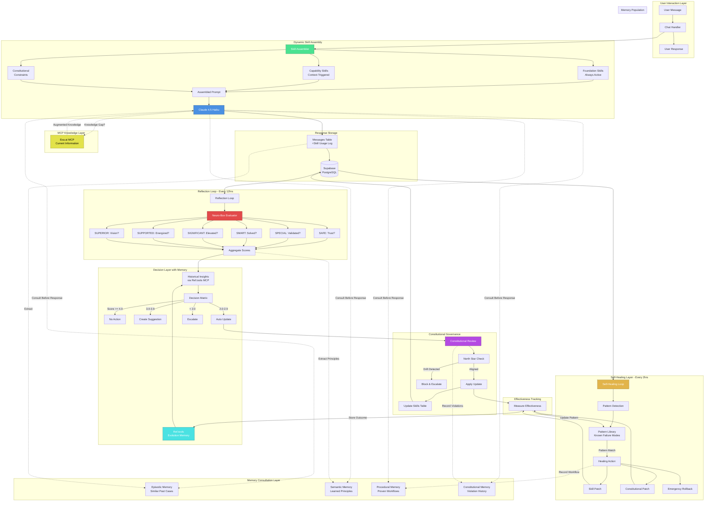

# ULTRAMIND Self-Annealing Architecture
## Visual System Diagram



## Data Flow Sequence

### Normal Operation
```
1. User sends message
2. Skill Assembler queries:
   - Foundation skills (always)
   - Triggered capability skills
   - Constitutional constraints
3. Assembled prompt sent to Claude
4. Claude consults 4 memory types
5. If knowledge gap: Query Exa.ai
6. Response generated
7. Stored with skill usage log
```

### Reflection Cycle (Every 12 hours)
```
1. Fetch last 20 conversations
2. Evaluate each on 6 Neuro-Box dimensions
3. Calculate aggregate scores
4. Consult Ref.tools for similar past situations
5. Make decision:
   - None (score >= 4.0)
   - Suggestion (3.0-3.9)
   - Auto-update (2.0-2.9)
   - Escalate (< 2.0)
6. If update: Constitutional review
7. Store reflection in Ref.tools
8. Measure effectiveness in next cycle
```

### Self-Healing Cycle (Every 2 hours, OR after 3 similar patterns)
```
1. Analyze recent reflections
2. Match against pattern library
3. If pattern threshold reached:
   a. Apply skill patch, OR
   b. Apply constitutional patch, OR
   c. Emergency rollback
4. Measure healing effectiveness
5. Update pattern library
6. Store workflow in procedural memory
```

## Memory Integration Points

### Episodic Memory
- **Populated:** Every user interaction
- **Queried:** Before generating response to find similar past cases
- **Updated:** Never (append-only historical record)

### Semantic Memory
- **Populated:** After each reflection (extract principles)
- **Queried:** Before making decisions ("What have we learned about X?")
- **Updated:** Confidence adjusted when validated/contradicted

### Procedural Memory
- **Populated:** When healing actions succeed
- **Queried:** Before applying corrections ("Has this workflow worked before?")
- **Updated:** Success rate after each execution

### Constitutional Memory
- **Populated:** When violations detected
- **Queried:** Before prompt updates ("Has this caused problems before?")
- **Updated:** When new safeguards created

## MCP Usage Patterns

### Ref.tools MCP
```
STORES:
- Every reflection log
- Every prompt update (before/after)
- Every healing event
- Every constitutional decision

QUERIES:
- "Similar situations to current scores/patterns"
- "Outcomes of past updates like this one"
- "Historical effectiveness of healing action X"
```

### Exa.ai MCP
```
TRIGGERS:
- Low confidence response detected
- Uncertainty markers in response
- Topic outside training data
- User asks about recent events

QUERIES:
- Semantic search for authoritative sources
- Filter to research papers, official docs
- Limit to 3 most relevant results

STORES:
- Sources in episodic memory
- New knowledge in semantic memory
```

### Supabase MCP
```
MANAGES:
- All tables (users, sessions, messages, etc.)
- Vector embeddings for semantic search
- Real-time subscriptions for UI
- Edge function deployments
```

## Key Architectural Principles

### 1. Progressive Disclosure
- Layer 1: Immediate core (500 tokens)
- Layer 2: Deeper context (1500 tokens)
- Layer 3: Examples (3000 tokens)
- Layer 4: Constitutional (1000 tokens)
- Total budget: ~8000 tokens for prompt

### 2. Proactive Healing
- Don't wait for critical failure
- Detect patterns early (3 occurrences)
- Apply corrections immediately
- Measure effectiveness

### 3. Constitutional Supremacy
- North Star cannot be compromised
- Critical constraints block auto-updates
- Weekly alignment verification
- Drift triggers immediate correction

### 4. Memory-Informed Decisions
- Every decision consults all 4 memory types
- Historical outcomes weigh heavily
- Patterns override individual cases
- Learning compounds over time

### 5. Lean MCP Integration
- Only 3 MCPs: Supabase, Ref.tools, Exa.ai
- Each has clear, non-overlapping purpose
- No "nice to have" integrations
- Minimize external dependencies
